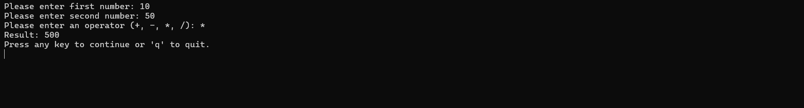

# Calculator Tool

Basic calculator tool that can perform addition, subtraction, multiplication, and division.

### Explanation
- The program prompts the user to enter two numbers and an operator.
  - The user can choose from `+`, `-`, `*`, or `/`.
  - Checks for 0 division and sets result to 0 to avoid errors.
  ```csharp
  result = num2 != 0 ? num1 / num2 : 0;
  ```
- It then performs the specified operation and displays the result.

# Screenshot
