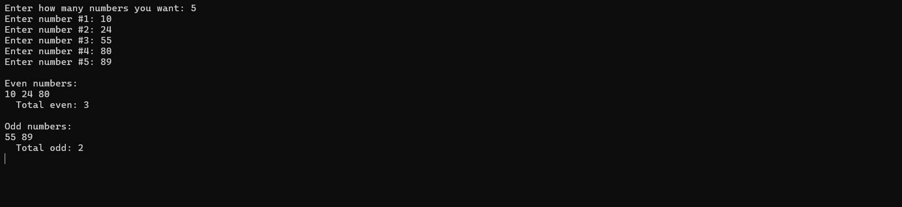

# Even-Odd Separator

A simple C# console app that takes N numbers and separates them into even and odd groups.

---

## Explanation
- Work with **arrays** and **foreach loops** in C#.
- Asks for size because `int[]` has fixed length.
  - Take multiple user inputs.
- Checks for Even or Odd by `if` statement.
- Prints result out.

---
# Screenshot
