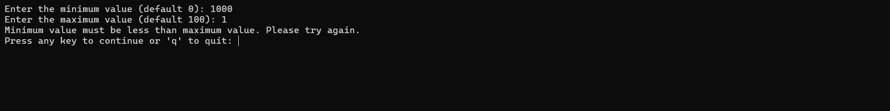

# Random Number Generator

Supports generating `int` and `double` random numbers.

# Explanation
- Use `System.Random` class and use its methods to generate random numbers.
  - `Next(minValue, maxValue)` method to generate random integers.
  - `NextDouble() * maxValue` method to generate random doubles.

# Valid Range

# Invalid Range
