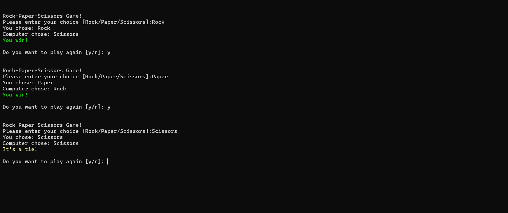

# Rock Paper Scissors Game

This is a simple _pretty colorful_ **Rock Paper Scissors** game implemented in **C# Console**.

---

## Explanation
- Initializes scores with zero.
- A while loop runs until the user decides to quit.
  - Lets user choose Rock, Paper, or Scissors.
  - Generates a random choice for the computer by:
  	- Because I have `choices` string list, I use `Random` class and `Next` method to get a number between 0 and 2 to randomly choose Computer's choice.
    ```csharp
    String[] choices = { "Rock", "Paper", "Scissors" };
    String computerChoice = choices[random.Next(choices.Length)];
    ```
  - Compares user and computer choices to determine the winner.
  - Displays the result of each round and updates scores.
  - Asks the user if they want to play again.
    - Displays the final scores when the user decides to quit.

---

# Playing


# Ending
